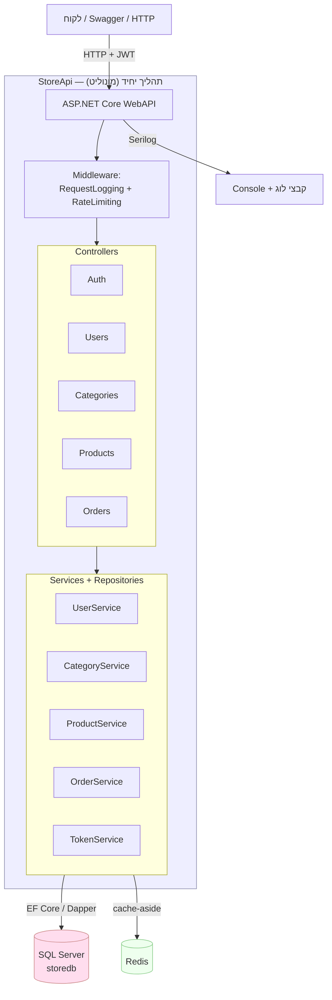

# שלב 1 — הבייסליין: המונוליט

מסמך זה מתעד את נקודת ההתחלה שלנו — ה-API המונוליטי הקיים תחת [`StoreApi/`](../StoreApi/) — כדי שנוכל להשוות "לפני מול אחרי" בסוף הפרויקט.

---

## 1. דיאגרמת הארכיטקטורה

הכול רץ כתהליך אחד (`StoreApi`), מול מסד נתונים רלציוני אחד (SQL Server) ומטמון אחד (Redis). כל הלוגיקה — מוצרים, קטגוריות, הזמנות, מלאי, משתמשים — יושבת יחד.

**מאפייני התשתית הקיימת:** EF Core + SQL Server · Redis כמטמון (דפוס decorator: `CachedProductService`, `CachedCategoryService`) · JWT לאימות · Serilog ללוגים · Rate-limiting middleware · פרויקט טסטים xUnit · `docker-compose.yml` שמריץ API + SQL + Redis.

---

## 2. רשימת ה-Endpoints

כל ה-routes תחת הבסיס `api/[controller]`.

### Auth — `api/auth`
| Method | Path | תיאור |
|---|---|---|
| POST | `/api/auth/login` | התחברות, מחזיר JWT |
| POST | `/api/auth/register` | הרשמת משתמש חדש |

### Users — `api/users`
| Method | Path | תיאור |
|---|---|---|
| GET | `/api/users` | כל המשתמשים |
| GET | `/api/users/{id}` | משתמש לפי מזהה |
| POST | `/api/users` | יצירת משתמש |
| PUT | `/api/users/{id}` | עדכון משתמש |
| DELETE | `/api/users/{id}` | מחיקת משתמש |

### Categories — `api/categories`
| Method | Path | תיאור |
|---|---|---|
| GET | `/api/categories` | כל הקטגוריות |
| GET | `/api/categories/{id}` | קטגוריה לפי מזהה |
| POST | `/api/categories` | יצירת קטגוריה |
| PUT | `/api/categories/{id}` | עדכון קטגוריה |
| DELETE | `/api/categories/{id}` | מחיקת קטגוריה |

### Products — `api/products`
| Method | Path | תיאור |
|---|---|---|
| GET | `/api/products` | כל המוצרים |
| GET | `/api/products/paged` | מוצרים עם עימוד |
| GET | `/api/products/{id}` | מוצר לפי מזהה |
| GET | `/api/products/category/{categoryId}` | מוצרים לפי קטגוריה |
| GET | `/api/products/search` | חיפוש מוצרים |
| GET | `/api/products/search/paged` | חיפוש עם עימוד |
| POST | `/api/products` | יצירת מוצר *(Manager/Admin)* |
| PUT | `/api/products/{id}` | עדכון מוצר *(Manager/Admin)* |
| DELETE | `/api/products/{id}` | מחיקת מוצר *(Admin)* |

### Orders — `api/orders`
| Method | Path | תיאור |
|---|---|---|
| GET | `/api/orders` | כל ההזמנות |
| GET | `/api/orders/{id}` | הזמנה לפי מזהה |
| GET | `/api/orders/user/{userId}` | הזמנות של משתמש |
| POST | `/api/orders` | יצירת הזמנה (בודקת מלאי + מורידה מלאי) |
| PUT | `/api/orders/{id}` | עדכון הזמנה/סטטוס |
| DELETE | `/api/orders/{id}` | מחיקת הזמנה |

> **הזרימה שבלב הפרויקט** — `POST /api/orders`: בקריאה אחת סינכרונית בודקים שהמשתמש קיים, לכל פריט בודקים מלאי, מורידים מלאי, ושומרים הזמנה — הכול מול אותו DB (ראו `OrderService.CreateOrderAsync`). זו בדיוק הזרימה שנפרק בהמשך ל-Order → Inventory → Notification דרך saga אסינכרוני.

---

## 3. שלוש בעיות שאנחנו צופים בסקייל

1. **פריסה מצומדת (deployment coupling).** כל שינוי קטן — למשל תיקון בלוגיקת הקטלוג — מחייב לבנות ולפרוס מחדש את *כל* האפליקציה, כולל הזמנות ותשלומים. סיכון גבוה בכל release, ואי-אפשר לשחרר צוותים/רכיבים בקצב עצמאי.

2. **צוואר בקבוק ב-DB יחיד.** כל הישויות חולקות מסד נתונים אחד. עומס קריאות כבד על טבלת המוצרים (ה"חמה" ביותר) מתחרה על אותם משאבים ונעילות עם כתיבת הזמנות — הזמנה יכולה להיתקע בגלל תעבורת דפדוף. אין בידוד בין עומסי עבודה.

3. **סקיילינג "הכול-או-כלום".** אם רק הקטלוג עמוס, אי-אפשר לשכפל *רק* אותו — צריך לשכפל את כל המונוליט (כולל חלקים שלא זקוקים לזה), מה שמבזבז זיכרון/CPU ומגדיל עלויות. אין scale-out ממוקד לפי הרכיב שבאמת נחנק.

> בונוס להצגה — בעיות נוספות אפשריות: תקלה ברכיב אחד (memory leak בקטלוג) מפילה את כל השירות; קושי לאמץ טכנולוגיה מתאימה לכל תחום (הכול חייב להיות SQL); וקוד-בייס אחד גדול שקשה לתחזק ולהבין ככל שהוא גדל.

---

**✔ Checkpoint שלב 1:** `docker compose up` בתוך [`StoreApi/`](../StoreApi/) → יוצרים מוצר, מבצעים הזמנה, ורואים את המלאי יורד. (עובד כבר היום.)
